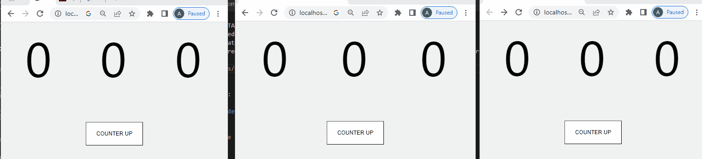

<p><code>SAZA-STATE</code> is a great state manager for react apps!</p>
<p>It does not need <code>Provider</code> Like context</code> or <code>react-redux</code></p>
<p>It save state on browser storage like <code>redux-persist</code> </p>
<p>It does not require external tools to apply changes in different tabs of the browser</p>
<p>It has optimized rendering.</p>
<p>

</p>

## Installation

<p>install <code>saza-state</code> with npm :</p>

```sh
npm i saza-state
```


## how to use?

```javascript
useSazaState(selector:Function);
```

for get states from ```saza-state``` :


```javascript
export { useSazaState } from "saza-state";

function Counter(){
    const counter = useSazaState(state=>state.counter) || 0;
    return (<p>{counter}</p>);
}


export default Counter;

```


```javascript
sazaDispatch(data:Object|string,payload?:Object);
```

for ```dispatch``` state to  ```saza-state``` :

```javascript
import { sazaDispatch as dispatch } from 'saza-state';

// set counter to 1 by clicking on this button
function Button(){
    return <button onClick={()=>dispatch({counter:1})}>Setup Counter</button>
}

export default Button;

```


## Add action

```javascript
addSazaAction(type:String,reducer:Function);
```


for add action to  ```saza-state``` you need to use ```addSazaAction``` :

```javascript
import { sazaDispatch as dispatch , addSazaAction } from 'saza-state';

// add counter up action 
addSazaAction(
    'counter_up', // type : must be unique 
    (state) =>{ // reducer for 'counter_up' action
        const counter = state.counter+1 || 1;
        return {
            ...state,
            counter
        }
    }
);

function Button(){
    return <button onClick={()=>dispatch('counter_up')}>Counter Up</button>
}

export default Button;

```

also you can pass ```payload``` to ```reducer``` :

```javascript
import { sazaDispatch as dispatch , addSazaAction } from 'saza-state';

// add counter down action 
addSazaAction(
    'counter_down', // type : must be unique 
    (state,payload) =>{ // reducer for 'counter_down' action
        const counter = state.counter-payload.count || 1;
        return {
            ...state,
            counter
        }
    }
);

function Button(){
    return <button onClick={()=>dispatch('counter_down',{count:1})}>Counter Down</button>
}

export default Button;

```

##  A Guide For Class Components


``` javascript
import { useSazaState, sazaDispatch as dispatch } from "saza-state";
import React from "react";

class ComponentC extends React.Component{
    
    render(){
        return (
        ...
        <p>{this.props.counter}</p>
        ...
        <button onClick={dispatch('counter_up')}>UP Counter</button>
        ...
        )
    }

}

export default function(){
    const counter = useSazaState(state=>state.counter);
    return <ComponentC counter={counter} /> 
};

```

It is recommended to always use the functional component like below : 


``` javascript
import { useSazaState, useSazaDispatch as dispatch } from "saza-state";
import React from "react";

class ComponentC extends React.Component{
    ...

    render(){
        return (
        ...
        <CounterValue />
        ...
        <button onClick={()=>dispatch('counter_up')}>UP Counter</button>
        ...
        )
    }

}

function CounterValue(){
    const counter = useSazaState(state=>state.counter);
    return <p>{counter}</p>
};

export default ComponentC;

```

## State Watcher

<p>You can add a state watcher! state watcher will executed for any state changes</p>

```javascript
addSazaStateWatcher(watcher:Function,selector?:Function);
```


```javascript
import { 
    sazaDispatch as dispatch,
    addSazaStateWatcher 
} from "saza-state";


import React from "react";

class ComponentC extends React.Component{

    state = {
        counter:0,
    }

    componentDidMount(){
        addSazaStateWatcher(
            (state)=>{ 
                this.setState({
                    counter:state.counter,
                });
            },
        ); // -> rerender for any change on state
    }
    
    render(){
        return <p >{this.state.counter}</p>
    }

}

export default ComponentC;

```

for get more optimized rendering on watcher pass a selector :

```javascript
import { 
    sazaDispatch as dispatch,
    addSazaStateWatcher 
} from "saza-state";


import React from "react";

class ComponentC extends React.Component{

    state = {
        counter:0,
    }

    componentDidMount(){

        addSazaStateWatcher(
            (counter)=>{ // -> just recived selected items on selector
                this.setState({
                    counter:counter,
                });
            },
            state=>state.counter // -> only rerender for state.counter changes
        );
    }
    
    render(){
        return <p >{this.state.counter}</p>
    }

}

export default ComponentC;

```

## Async Dispatch


```javascript
sazaAsyncDispatch(dispatcher:Function);
```


You can use asynchronous actions. ```sazaAsyncDispatch``` receives a function and creates an asynchronous action for use!

```javascript
import { useSazaState , sazaAsyncDispatch as asyncDispatch  } from "saza-state";
import { useEffect } from "react";

function ComponentA(){
    const counter = useSazaState(state=>state.counter) || 0;

    const startCounter = ()=>{
        asyncDispatch(dispatch=>{
            setInterval(()=>{
            dispatch('counter_up');
            },1000);
        });
    }

    useEffect(()=>{
        startCounter();
    },[]);

    return (<p >
        {counter}
    </p>);
}

export default ComponentA;

```


## Enable State Saving on localStorage


```javascript
setupSazaStorageItems(items:String[]);
```

You can specify any of the properties of the state object to store in local storage. 
In this case, you will get the past information of the browser. Also, the information in different tabs is always synced


```javascript
import { setupSazaStorageItems } from 'saza-state';


setupSazaStorageItems([
    'counter', // state.counter will save on localstorage,
]);


function App() {
  return (
    ...
  );
}

export default App;
```


## useSazaFetcher

```useSazaFetcher``` is a one-line data fetcher!

```javascript
useSazaFetcher(url:string,key:string,options?:object) : { key:object ,reload:Function} ;

```
for example if we need to get todo list from api

```javascript
import {useSazaFetcher} from "saza-state";

function DataFetcher(){

    const {fetcherTodos,reload} = useSazaFetcher('/todos.json','fetcherTodos');

    // fetcherTodos is an object with isLoading,error and data , fetcherTodos equals with passed key to useSazaFetcher
    // reload is a method to reload data from api
    console.log(fetcherTodos);

    const todos = ()=>{
        if(fetcherTodos.isLoading) return <div>is loading ...</div>;
        else if(fetcherTodos.error) return <div>error when loading!</div>;
        else if(fetcherTodos.data.length === 0) return <div>There are nothing to display!</div>;
        else return <div>{fetcherTodos.data.map((todo,index)=><article key={index}>{todo.title}</article>)}</div>;
    }

    return (<>
        <button onClick={reload}>reload</button>
        {todos()}
    </>);

}

```

third argument for ```useSazaFetcher``` is ```fetch``` api option. for example if you need get data from a post request:

```javascript
function MyComponent(){

    const {requestData,reload} = useSazaFetcher('/todos.json','requestData' , {method:'POST',});

    ...

}
```